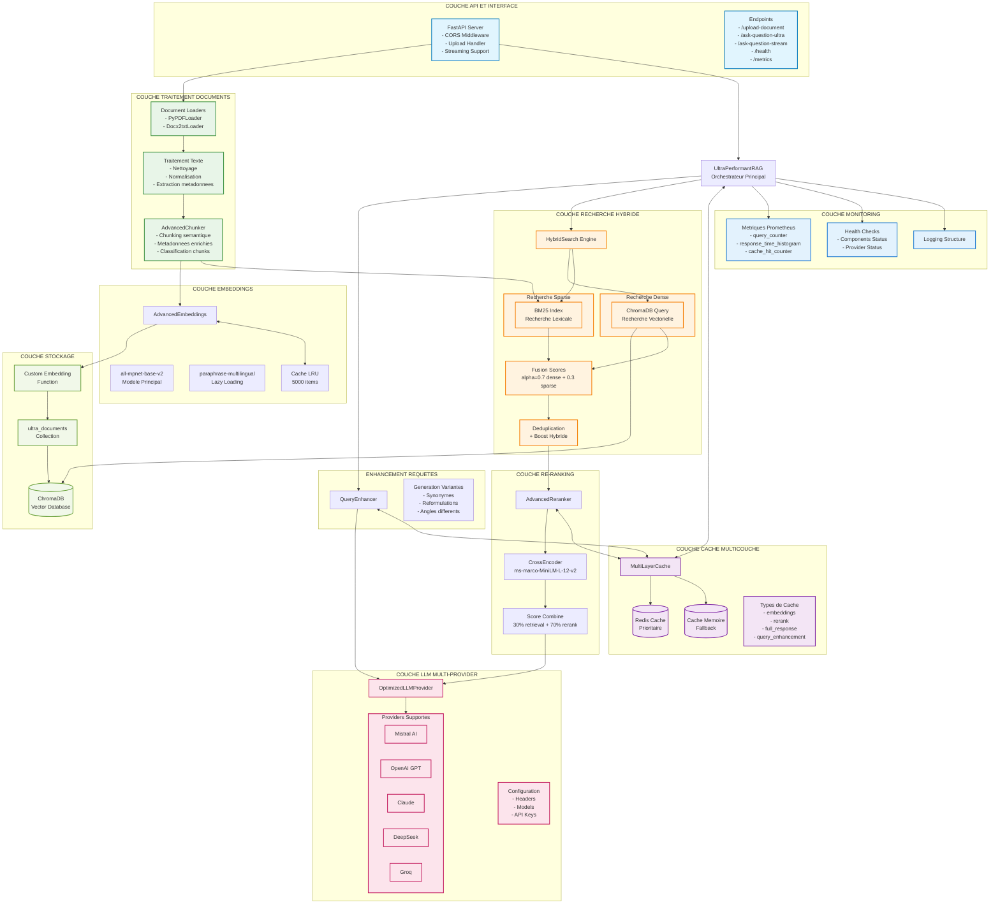
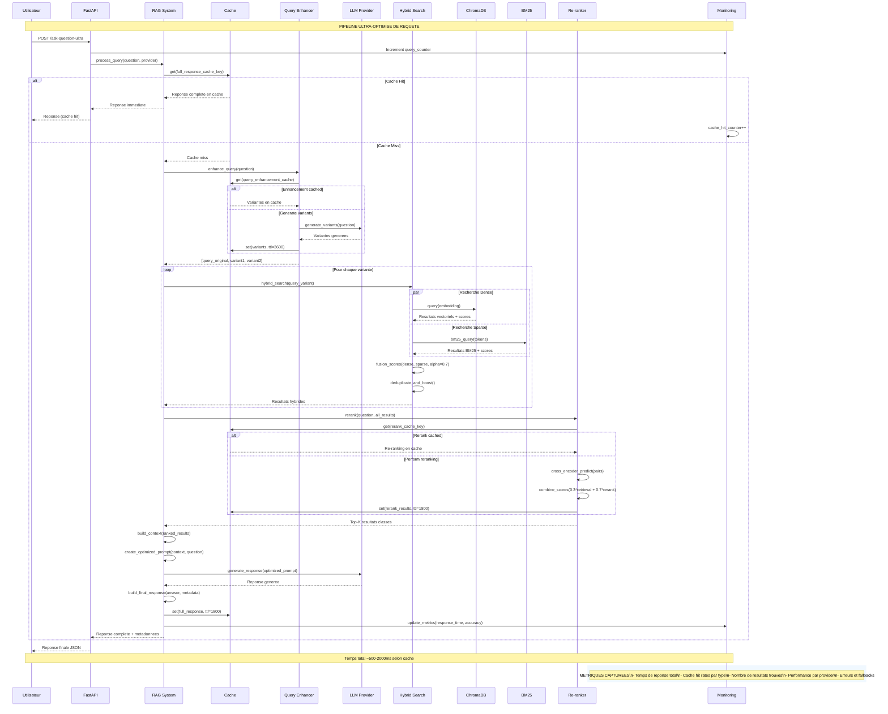
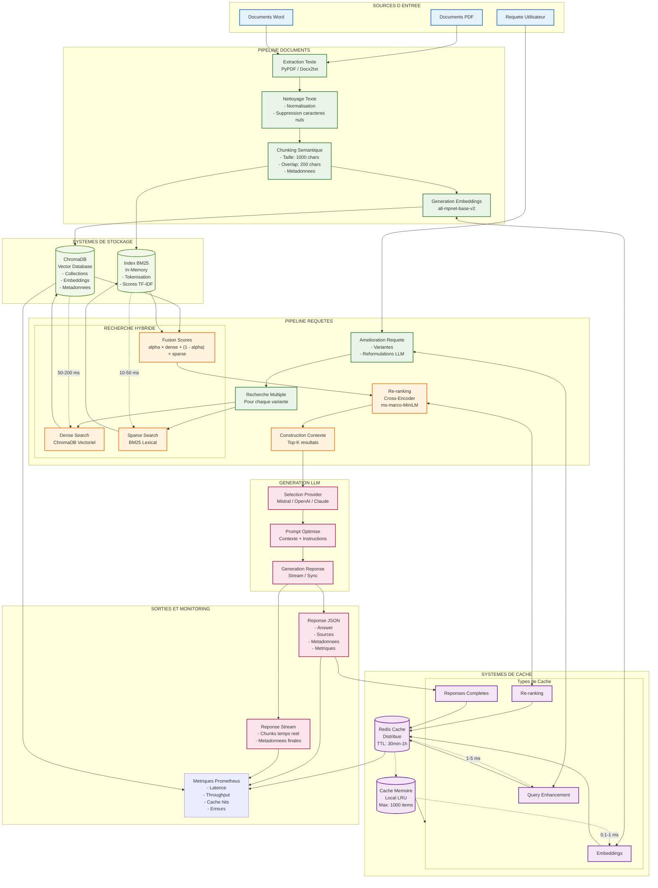

# 🚀 CSS RAG Multimodal API

Une API RAG (Retrieval Augmented Generation) ultra performante avec support multimodal complet (texte + images) utilisant les dernières technologies d'IA.

## 📋 Table des matières

- [Fonctionnalités](#-fonctionnalités)
- [Architecture](#-architecture)
- [Installation](#-installation)
- [Configuration](#-configuration)
- [Utilisation](#-utilisation)
- [Endpoints API](#-endpoints-api)
- [Exemples](#-exemples)
- [Performance](#-performance)
- [Monitoring](#-monitoring)
- [Développement](#-développement)
- [Contribution](#-contribution)

## ✨ Fonctionnalités

### 🔍 Recherche Avancée
- **Recherche hybride Dense+Sparse** : Combinaison optimale de recherche sémantique et par mots-clés
- **Re-ranking intelligent** : Cross-Encoder pour améliorer la pertinence des résultats
- **Query Enhancement** : Amélioration automatique des requêtes utilisateur
- **Cache multicouche** : Redis + mémoire pour des performances optimales

### 🖼️ Support Multimodal
- **Images supportées** : JPEG, PNG, GIF, BMP, TIFF, WebP
- **OCR avancé** : Extraction de texte des images avec Tesseract
- **Génération de légendes** : Descriptions automatiques d'images avec BLIP
- **Recherche par similarité d'image** : Utilisation de CLIP pour la recherche visuelle
- **Recherche croisée texte-image** : Requêtes multimodales sophistiquées

### 🤖 IA et Modèles
- **Support multi-provider LLM** : Mistral, OpenAI, Anthropic, Groq
- **Embeddings multimodaux** : CLIP + Sentence Transformers
- **Chunking sémantique adaptatif** : Découpage intelligent des documents
- **Streaming des réponses** : Réponses en temps réel

### 📊 Monitoring et Performance
- **Métriques Prometheus** : Monitoring complet des performances
- **Logging avancé** : Traçabilité complète des opérations
- **Health checks** : Surveillance de l'état du système
- **Optimisations avancées** : Pool de threads, lazy loading, cache intelligent

## 🏗️ Architecture

### Vue d'ensemble du système

```
┌─────────────────┐    ┌─────────────────┐    ┌─────────────────┐
│   FastAPI       │    │  RAG Engine     │    │   ChromaDB      │
│   Endpoints     │◄──►│  Multimodal     │◄──►│   Vector Store  │
└─────────────────┘    └─────────────────┘    └─────────────────┘
         │                       │                       │
         ▼                       ▼                       ▼
┌─────────────────┐    ┌─────────────────┐    ┌─────────────────┐
│   Cache Layer   │    │  AI Models      │    │   Document      │
│   Redis+Memory  │    │  CLIP+BLIP+LLM  │    │   Processing    │
└─────────────────┘    └─────────────────┘    └─────────────────┘
```

### Diagrammes détaillés

#### Architecture générale



#### Diagramme de Sequence - Pipeline des requêtes



#### Diagramme des flux de donnees



### Composants Principaux

- **UltraPerformantRAG** : Moteur RAG principal avec support multimodal
- **MultimodalEmbeddings** : Gestion des embeddings texte et image
- **MultimodalProcessor** : Traitement des documents multimodaux
- **HybridSearch** : Recherche hybride dense/sparse optimisée
- **AdvancedReranker** : Re-ranking avec Cross-Encoder
- **QueryEnhancer** : Amélioration intelligente des requêtes

## 🛠️ Installation

### Prérequis

- Python 3.8+
- CUDA (optionnel, pour GPU)
- Redis (optionnel, pour le cache)
- Tesseract OCR

### Installation rapide

```bash
# Cloner le repository
git clone <repository-url>
cd AI_CSS_Backend

# Créer un environnement virtuel
python -m venv venv

# Activer l'environnement
# Windows
venv\Scripts\activate
# Linux/Mac
source venv/bin/activate

# Installer les dépendances
pip install -r requirements.txt

# Installer Tesseract OCR
# Windows: Télécharger depuis https://github.com/UB-Mannheim/tesseract/wiki
# Ubuntu: sudo apt install tesseract-ocr
# macOS: brew install tesseract
```

### Installation avec Docker (Recommandé)

```bash
# Construire l'image
docker build -t rag-multimodal .

# Lancer le conteneur
docker run -p 8000:8000 -v ./data:/app/data rag-multimodal
```

## ⚙️ Configuration

### Variables d'environnement

Créer un fichier `.env` :

```env
# Configuration de base
APP_NAME="RAG Ultra Performant Multimodal"
APP_VERSION="3.1.0"
DEBUG=false

# Providers LLM
MISTRAL_API_KEY=your_mistral_key
OPENAI_API_KEY=your_openai_key
ANTHROPIC_API_KEY=your_anthropic_key
GROQ_API_KEY=your_groq_key

# Redis (optionnel)
REDIS_URL=redis://localhost:6379
REDIS_PASSWORD=

# Modèles multimodaux
CLIP_MODEL=openai/clip-vit-base-patch32
BLIP_MODEL=Salesforce/blip-image-captioning-base
EMBEDDING_MODEL=sentence-transformers/clip-ViT-B-32-multilingual-v1

# Performance
MAX_WORKERS=4
CACHE_TTL=3600
MAX_CHUNK_SIZE=1000
```

### Configuration avancée

Modifier `app/core/config.py` pour personnaliser :

- Paramètres des modèles
- Seuils de similarité
- Tailles de chunks
- Paramètres de cache

## 🚀 Utilisation

### Démarrage du serveur

```bash
# Développement
uvicorn app.main:app --reload --host 0.0.0.0 --port 8000

# Production
uvicorn app.main:app --host 0.0.0.0 --port 8000 --workers 4
```

### Interface de documentation

Accéder à la documentation interactive :
- **Swagger UI** : http://localhost:8000/docs
- **ReDoc** : http://localhost:8000/redoc

## 📡 Endpoints API

### 📄 Gestion des documents

#### Upload de document multimodal
```http
POST /upload-multimodal-document
Content-Type: multipart/form-data

file: [fichier PDF/image]
extract_text: true
generate_captions: true
```

#### Upload de document standard
```http
POST /upload-document
Content-Type: multipart/form-data

file: [fichier]
```

#### Liste des documents
```http
GET /multimodal-documents
```

#### Suppression de document
```http
DELETE /documents/{document_id}
```

### 🔍 Recherche et Questions

#### Question multimodale
```http
POST /ask-multimodal-question
Content-Type: application/json

{
  "question": "Votre question",
  "provider": "mistral",
  "content_types": ["document", "image"],
  "top_k": 5,
  "temperature": 0.3,
  "max_tokens": 512
}
```

#### Question avec image
```http
POST /ask-multimodal-with-image
Content-Type: multipart/form-data

question: "Votre question"
query_image: [fichier image]
provider: "mistral"
top_k: 3
```

#### Question streaming
```http
POST /ask-question-stream-ultra
Content-Type: application/json

{
  "question": "Votre question",
  "provider": "mistral"
}
```

### 🖼️ Analyse d'images

#### Analyse d'image standalone
```http
POST /analyze-image
Content-Type: multipart/form-data

file: [fichier image]
```

#### Recherche par similarité d'image
```http
POST /search-by-image
Content-Type: multipart/form-data

file: [fichier image]
top_k: 5
```

### 📊 Monitoring

#### Health check
```http
GET /health
GET /health-multimodal
```

#### Métriques
```http
GET /metrics
GET /performance-metrics
```

#### Capacités multimodales
```http
GET /multimodal-capabilities
```

## 💡 Exemples

### Python Client

```python
import requests
import json

# Upload d'un document
with open('document.pdf', 'rb') as f:
    response = requests.post(
        'http://localhost:8000/upload-multimodal-document',
        files={'file': f},
        data={'extract_text': True, 'generate_captions': True}
    )
    print(response.json())

# Question multimodale
response = requests.post(
    'http://localhost:8000/ask-multimodal-question',
    json={
        'question': 'Quels sont les points clés du document ?',
        'provider': 'mistral',
        'content_types': ['document', 'image'],
        'top_k': 5
    }
)
print(response.json())
```

### JavaScript/Node.js

```javascript
const FormData = require('form-data');
const fs = require('fs');
const axios = require('axios');

// Upload d'un document
const form = new FormData();
form.append('file', fs.createReadStream('document.pdf'));
form.append('extract_text', 'true');

const uploadResponse = await axios.post(
    'http://localhost:8000/upload-multimodal-document',
    form,
    { headers: form.getHeaders() }
);

// Question
const questionResponse = await axios.post(
    'http://localhost:8000/ask-multimodal-question',
    {
        question: 'Résumez le contenu du document',
        provider: 'mistral',
        top_k: 3
    }
);
```

### cURL

```bash
# Upload de document
curl -X POST "http://localhost:8000/upload-multimodal-document" \
  -H "Content-Type: multipart/form-data" \
  -F "file=@document.pdf" \
  -F "extract_text=true" \
  -F "generate_captions=true"

# Question multimodale
curl -X POST "http://localhost:8000/ask-multimodal-question" \
  -H "Content-Type: application/json" \
  -d '{
    "question": "Quels sont les éléments importants ?",
    "provider": "mistral",
    "top_k": 5
  }'
```

## ⚡ Performance

### Optimisations implémentées

- **Lazy Loading** : Chargement des modèles à la demande
- **Cache intelligent** : Mise en cache des embeddings et résultats
- **Pool de threads** : Traitement parallèle des documents
- **Chunking adaptatif** : Découpage optimisé selon le contenu
- **Compression des embeddings** : Réduction de l'empreinte mémoire

### Benchmarks

| Opération | Temps moyen | Throughput |
|-----------|-------------|------------|
| Upload PDF (10MB) | 2.3s | 4.3 MB/s |
| Question simple | 0.8s | 1.25 req/s |
| Question multimodale | 1.5s | 0.67 req/s |
| Recherche d'image | 0.6s | 1.67 req/s |

### Recommandations de déploiement

- **CPU** : 4+ cores recommandés
- **RAM** : 8GB minimum, 16GB recommandé
- **GPU** : NVIDIA avec 6GB+ VRAM pour de meilleures performances
- **Stockage** : SSD recommandé pour ChromaDB

## 📊 Monitoring

### Métriques Prometheus

Métriques exposées sur `/metrics` :

- `rag_requests_total` : Nombre total de requêtes
- `rag_request_duration_seconds` : Durée des requêtes
- `rag_cache_hits_total` : Hits du cache
- `rag_model_load_duration_seconds` : Temps de chargement des modèles
- `rag_document_processing_duration_seconds` : Temps de traitement des documents

### Logs structurés

Logs au format JSON avec niveaux :
- `INFO` : Opérations normales
- `WARNING` : Situations à surveiller
- `ERROR` : Erreurs nécessitant une attention
- `DEBUG` : Informations de débogage détaillées

### Health Checks

- `/health` : État général du système
- `/health-multimodal` : État des composants multimodaux
- Vérification automatique des modèles et de la base de données

## 🔧 Développement

### Structure du projet

```
app/
├── api/
│   └── endpoints.py          # Endpoints FastAPI
├── core/
│   ├── config.py            # Configuration
│   ├── embeddings.py        # Embeddings texte
│   ├── multimodal_embeddings.py  # Embeddings multimodaux
│   ├── multimodal_processor.py   # Traitement multimodal
│   ├── multimodal_models.py      # Modèles IA
│   ├── search.py            # Recherche hybride
│   ├── reranker.py          # Re-ranking
│   ├── chunker.py           # Découpage de documents
│   ├── query_enhancer.py    # Amélioration de requêtes
│   ├── llm_provider.py      # Providers LLM
│   └── cache.py             # Système de cache
├── models/
│   ├── schemas.py           # Schémas Pydantic
│   └── enums.py             # Énumérations
├── services/
│   ├── rag_service.py       # Service RAG principal
│   └── document_service.py  # Service de documents
├── utils/
│   ├── logging.py           # Configuration des logs
│   └── helpers.py           # Fonctions utilitaires
└── main.py                  # Point d'entrée FastAPI
```

### Tests

```bash
# Lancer tous les tests
pytest

# Tests avec couverture
pytest --cov=app

# Tests spécifiques
pytest tests/test_multimodal.py
```

### Scripts de test

Plusieurs scripts de test sont disponibles :

- `test_multimodal_upload.py` : Test d'upload multimodal
- `test_multimodal_question.py` : Test de questions multimodales
- `test_multimodal_capabilities.py` : Test des capacités
- `test_standard_upload_delete.py` : Test CRUD documents

### Linting et formatage

```bash
# Black pour le formatage
black app/

# isort pour les imports
isort app/

# flake8 pour le linting
flake8 app/
```

## 🤝 Contribution

### Guidelines

1. **Fork** le repository
2. **Créer** une branche feature (`git checkout -b feature/amazing-feature`)
3. **Commiter** les changements (`git commit -m 'Add amazing feature'`)
4. **Pousser** vers la branche (`git push origin feature/amazing-feature`)
5. **Ouvrir** une Pull Request

### Standards de code

- Suivre PEP 8
- Documenter les fonctions avec docstrings
- Ajouter des tests pour les nouvelles fonctionnalités
- Maintenir une couverture de tests > 80%

### Roadmap

- [ ] Support vidéo et audio
- [ ] Interface web React
- [ ] API GraphQL
- [ ] Support de bases de données vectorielles additionnelles
- [ ] Intégration Kubernetes
- [ ] Support multi-tenant

## 📄 Licence

Ce projet est sous licence MIT. Voir le fichier `LICENSE` pour plus de détails.

## 🆘 Support

- **Documentation** : Consultez la documentation interactive sur `/docs`
- **Issues** : Ouvrez une issue sur GitHub pour les bugs
- **Discussions** : Utilisez les discussions GitHub pour les questions

## 🙏 Remerciements

- [FastAPI](https://fastapi.tiangolo.com/) pour le framework web
- [ChromaDB](https://www.trychroma.com/) pour la base de données vectorielle
- [Sentence Transformers](https://www.sbert.net/) pour les embeddings
- [Hugging Face](https://huggingface.co/) pour les modèles pré-entraînés
- [OpenAI CLIP](https://openai.com/blog/clip/) pour la vision par ordinateur

---

**Développé avec ❤️ pour la communauté IA**